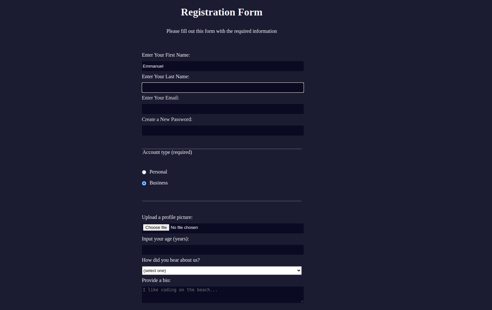

# the second form i commented in the css file 

# Registration Form

This is a simple registration form built using HTML and CSS. It collects user information such as first name, last name, email, password, account type, profile picture, age, referrer, bio, and acceptance of terms and conditions.

## How to Use

1. Clone or download this repository.
2. Open the `index.html` file in a web browser.
3. Fill out the form with the required information.
4. Click the "Submit" button to submit the form.

## Form Fields

- **First Name**: This field is required. Enter your first name.
- **Last Name**: This field is required. Enter your last name.
- **Email**: This field is required. Enter your email address.
- **New Password**: This field is required. Create a new password. It should be at least 8 characters long and can contain lowercase letters and numbers.
- **Account Type**: Select your account type. You can choose between "Personal" and "Business" account.
- **Profile Picture**: Upload a profile picture.
- **Age**: Enter your age in years. The minimum age allowed is 13, and the maximum is 120.
- **Referrer**: Select how you heard about the registration form from the given options or choose "Other" if none of the options apply.
- **Bio**: Provide a short bio about yourself.
- **Terms and Conditions**: Check the box to accept the terms and conditions.

## License

This project is licensed under the [MIT License](LICENSE).